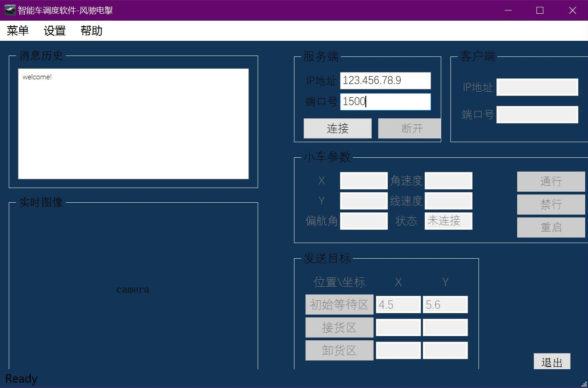

# 轻舟智能车上位机

远程调度系统

___

## 主面板

## 功能介绍

## 关于
<html>
    <head>
        
    </head>
    <about>
        <h3>智能车调度软件 v1.0</h3>
        
参赛队伍: 风驰电掣

        
所属学校: 华北电力大学(保定)

        
要了解更多信息，请访问<a href="https://github.com/zhengyinloong/qingzhou_shangweiji">https://github.com/zhengyinloong/qingzhou_shangweiji</a>

    </about>
</html>